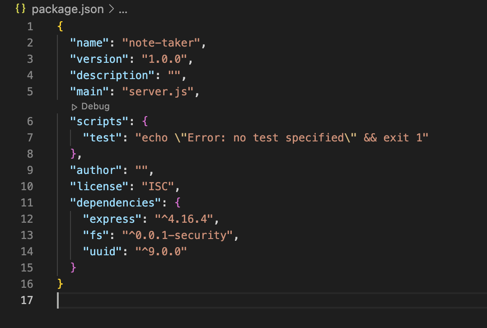

# Express Note Taker

## Description

This project is designed to help a potential user share their created notes with another user on a different device through Heroku CLI. Contrary to an earlier learning project where local storage was utilized to store important notes of an upcoming day, this project uses a json file. The app uses the uuid package to generate unique IDs for each note that is created. These IDs are important in getting notes later in the delete route. In this early development, there are only three routes: `GET`, `POST`, and `DELETE`. Understanding Heroku is a vital tool in learning how to develop apps that are not simply static pages, like prior projects. 

## Table of Contents 

- [Installation](#installation)
- [Usage](#usage)
- [Credits](#credits)
- [License](#license)
- [Badges](#badges)
- [Tests](#tests)
- [Questions](#questions)

## Installation

In order to get the environment to run, the user will need to install a couple vital packages, being fs, express, and uuid. Please ensure that version 4.16.4 of express is installed, as well as version 9.0.0 of uuid is installed. Importantly the user will need to begin with the command `npm init`, followed by `npm install express@4.16.4` and `npm install uuid@9.0.0`. 

## Usage

First, the user should open the URL to the deployed site on Heroku.

[Note Taker](https://obscure-tor-52322-6bd0bbddb400.herokuapp.com)

Then the user will find the user-friendly and interactive site. Upon clicking the `Get Started` button, the user will be redirected to the `/notes` page. The user will see two text boxes where a title and description of for the note can be typed in. The user will see a save button pop up in the upper-right corner. After saving a note, the boxes will clear and the user can get started on their next important note. Feel free to share the link with others to view all important notes added by the user. 

## Credits

David Montoto

## License

[Unlicensed](LICENSE)

## Badges

## Tests

N/A